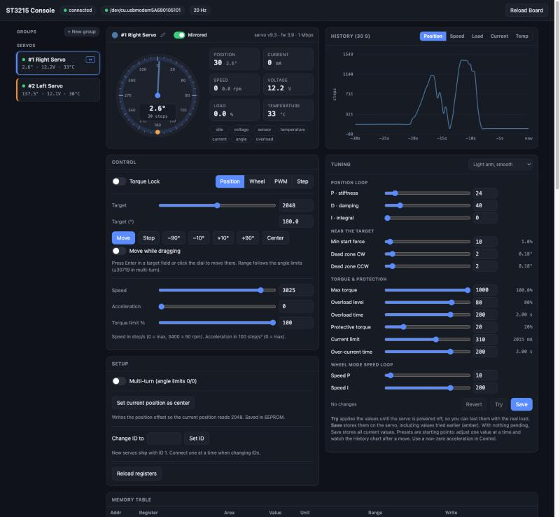

# go-st3215

Go package for controlling and monitoring **Waveshare ST3215** serial bus servos
(Feetech STS3215 protocol) through the **Waveshare Bus Servo Adapter (A)**.
Works on Linux and macOS. The only dependency is `go.bug.st/serial`.



*The [web console demo](#demo-web-console) driving two ST3215 servos.*

```go
import st3215 "github.com/frifox/go-st3215"

bus, err := st3215.Open("/dev/ttyACM0", st3215.DefaultBaudRate) // 1 Mbps, factory default
if err != nil {
    log.Fatal(err)
}
defer bus.Close()

pan, tilt := bus.Servo(1), bus.Servo(2)
bus.SyncTorque(true, 1, 2)

// Move both servos at the same time, then wait until each one arrives.
bus.SyncMove(
    st3215.Target{ID: 1, Position: st3215.DegreesToSteps(90), Speed: 1500, Acc: 50},
    st3215.Target{ID: 2, Position: st3215.DegreesToSteps(200), Speed: 1500, Acc: 50},
)
opt := st3215.WaitOptions{FailOn: st3215.StatusOverload}
pan.WaitForPosition(ctx, st3215.DegreesToSteps(90), opt)
tilt.WaitForPosition(ctx, st3215.DegreesToSteps(200), opt)

// Read the status of both servos in one round trip.
fb, _ := bus.SyncFeedback(1, 2)
fmt.Printf("%.1f° %.1fV %d°C %.0fmA %s\n",
    fb[1].Degrees(), fb[1].Voltage, fb[1].Temperature, fb[1].Current, fb[1].Status)
```

## What it covers

| Area | API |
|---|---|
| Discovery | `Bus.Scan`, `Bus.Ping`, `Bus.Identify` (one servo on the bus) |
| Position mode | `MoveTo`, `MoveToDegrees`, `MoveToAndWait`, `Stop`, `SetAcceleration` |
| Multi-turn | `SetMultiTurn(true)` → goal range ±30719 steps (±7.5 turns) |
| Shortest path | `MoveToShortest` (servo and group) / `NearestEquivalent`: in multi-turn mode, go the short way round across 0°/360° |
| Other modes | `SetMode(ModeWheel/ModePWM/ModeStep)`, `SetWheelSpeed`, `SetPWM` |
| Multiple servos | `Bus.SyncMove`, `Bus.SyncTorque`, `Bus.SyncFeedback`, `RegMoveTo` + `Bus.Action` |
| Mirroring | `Bus.SetMirrored(id, true)` / `WithMirrored(ids...)` for a servo mounted facing its partner: the same commands move both in sync |
| Groups | `bus.Group(ids...)`: `MoveTo`, `EnableTorque`, `SetWheelSpeed`, `Align`, `CopyFromLeader`, `WaitForPosition`, `Feedback().Spread()` / `.Fighting()` (one packet per command) |
| Auto-tuning | `autotune.Run(ctx, autotune.ForServo(s) / ForGroup(g), opts)`: finds P, D, start force and dead zone by test moves with the real load |
| Monitoring | `Feedback` (position, speed, load, voltage, temperature, current, moving, status in one read), plus single getters |
| Torque | `EnableTorque`, `SetTorqueLimit` (runtime), `SetMaxTorque` (persisted) |
| Calibration | `CalibrateMiddle` (current position becomes 2048), `SetPositionOffset` |
| Configuration | `SetID`, `SetBaudRate`, `SetAngleLimits`, `SetVoltageLimits`, `SetMaxTemperature`, `SetProtection`, `SetPID`, `SetDeadZone`, `ReadConfig` |
| Raw access | `Servo.Read(reg)` / `Servo.Write(reg, v)` for every register in `Registers`; `Bus.Read/Write/SyncRead/SyncWrite` |
| Tuning trials | `Servo.WriteTemporary(reg, v)` applies EEPROM settings (PID, dead zone, protection...) until power-off without saving them |
| Faults | `Status` bit set (voltage, sensor, temperature, current, angle, overload); `WithStatusHandler` callback |

EEPROM writes are wrapped in unlock → write → lock automatically so they survive power cycles.
The `Bus` is safe for concurrent use.

## Mirrored servos

When two servos drive one axis from opposite sides (facing each other), the same command turns
them in opposite directions. Mark one as mirrored and use the same logical values for both:

```go
bus.SetMirrored(2, true) // or st3215.Open(dev, baud, st3215.WithMirrored(2))

bus.SyncMove(
    st3215.Target{ID: 1, Position: 1500, Speed: 1000, Acc: 30},
    st3215.Target{ID: 2, Position: 1500, Speed: 1000, Acc: 30}, // physically 4096-1500
)
```

For a mirrored servo every typed call works in logical coordinates: positions are reflected
about 2048 (`4096 - p`), and speed, load, current, wheel speed, PWM duty and `StepBy` steps
change sign. Angle limits are reflected, and `ReadConfig`, `Feedback`, `SyncFeedback` and
`WaitForPosition` report logical values. Raw register access (`Servo.Read/Write`,
`Bus.Read/Write/SyncRead/SyncWrite`) and `PositionOffset` stay physical.

Calibrate both servos so 2048 is the same mechanical pose (`CalibrateMiddle` in that pose, or
`SetPositionOffset`), otherwise they track with a constant offset. The flag is kept on the
`Bus` by ID (it follows `SetID`) and is not stored on the servo, so set it each time your
program starts.

## Servo groups

`Group` drives several servos as one: each command is a single SYNC WRITE, so all members start
at the same instant, and positions are logical, so mirrored members follow too.

```go
pitch := bus.Group(1, 2)               // leader first
pitch.Align(200, 10)                   // bring members to the leader's position
pitch.EnableTorque(true)
pitch.MoveTo(1500, 1000, 30)
fb, _ := pitch.WaitForPosition(ctx, 1500, st3215.WaitOptions{})
if fb.Spread() > 20 || fb.Fighting(30) { /* members disagree on a shared axis */ }
```

## Auto-tuning

The `autotune` sub-package finds position-loop settings by experiment: it applies candidate values
(until power-off), makes short test moves around the current position with the real load, and scores
each response for accurate and calm motion (overshoot, wobble, hunting, and for groups how much the
members disagree). It hill-climbs P, D, start force and dead zone (I is left alone) in about 15–30
tests. Moves stay within ±35° and anything beyond 45° aborts; faults, high current or temperature
abort too, and an abort restores the original values.

```go
res, err := autotune.Run(ctx, autotune.ForGroup(bus.Group(1, 2)), autotune.Options{})
if err == nil {
    fmt.Println(res.Before.Metrics, "→", res.Best.Metrics) // Best is active until power-off
    autotune.SaveParams(autotune.ForGroup(bus.Group(1, 2)), res.Best.Params)
}
```

Tune with the real load mounted, near the middle of the range you'll use, after mirroring and center
calibration are set up. Grouped servos are always tuned together.

## Demo: web console

[`example/`](example) is a WebSocket server plus a web page to set up, monitor and drive the servos.
The page walks through three steps:

1. **Driver board**: lists serial ports with their USB details and marks likely adapters
   (WCH CH34x, FTDI, CP210x, PL2303). Pick one (or the built-in simulator) and a baud rate.
2. **Find servos**: scans an ID range (quick 0–20 or full 0–253) with live progress.
3. **Monitor & control**: only the servos found are shown. You get a live position dial, telemetry,
   30 s history charts, controls for every mode, setup actions (center calibration, ID change,
   multi-turn), a Tuning card (position loop gains, dead zones, start force, torque and protection,
   with presets and **Auto…** tuning; **Try** applies until power-off, **Save** persists) and an
   editable view of the full memory table.

```bash
cd example
go run .                               # pick the board in the browser
go run . -port /dev/ttyACM0            # connect + scan on startup (Linux)
go run . -port /dev/cu.usbmodem1101    # connect + scan on startup (macOS)
go run . -sim 1,2,3                    # simulated servos, no hardware needed
```

Then open http://localhost:8080. Other flags: `-baud`, `-addr`, `-poll` (telemetry interval,
default 50 ms), `-nosync` (poll servos one by one if SYNC READ misbehaves) and `-config`.

Per-servo settings that can't be stored on the servo are kept in
[`example/config.toml`](example/config.toml), keyed by servo ID. The web UI writes it when you
edit a servo (pencil next to its name: name, color, mirrored, virtual 0°) or change an ID. Edits made by hand are read on startup:

```toml
[1]
Name = "Left"

[2]
Name = "Right"
Mirrored = true
Zero = 270.0   # virtual 0°: physical 270° is shown as 0°, straight up as 90°
```

**Groups** (sidebar → New group) drive their members together from one console: one needle and
one chart line per servo (each servo keeps its own color everywhere), a row per member, and a Group
health card with spread, opposing load, fight protection (warn, or cut torque), Align and Copy
tuning (plus Auto-tune group). Groups and colors are stored in `config.toml`:

```toml
[group.pitch]
Name = "Pitch"
Members = [1, 2]        # leader first
OnFight = "torque-off"  # default "warn"
```

Several browser windows can be open at once: connection, scan, telemetry, names, mirrored state and
servo settings stay in sync across them (each window still picks its own selected servo).

The demo is a separate Go module (`example/go.mod`), so the library itself only depends on
`go.bug.st/serial`. Listing USB port details uses cgo on macOS (the Xcode command line tools).

## Platform notes

- **Adapter**: set the jumper on the Bus Servo Adapter (A) to the USB/PC position.
  Power the servos from the adapter's DC input (6–12 V per the Waveshare manual). The
  memory table's factory `MaxVoltage` is 8.0 V. If your supply is higher, check the `Status` in `Feedback`
  for a `voltage` status and raise it with `SetVoltageLimits`.
- **Linux**: the adapter shows up as `/dev/ttyACM0` or `/dev/ttyUSB0`. Add your user to
  the `dialout` group (`uucp` on Arch). For lower latency with FTDI/CH34x drivers,
  `setserial /dev/ttyUSB0 low_latency` helps when polling many servos quickly.
- **macOS**: use the `/dev/cu.*` device (not `/dev/tty.*`), e.g. `/dev/cu.usbmodem…` or
  `/dev/cu.wchusbserial…`. Recent macOS includes the CH34x driver.
- Each new servo ships with ID 1. Connect them **one at a time** and give each a unique
  ID (`Servo.SetID`, or the Setup panel of the demo) before chaining them.

## Things to verify on hardware

- `PWMSignBit`: the vendor memory table says the PWM direction bit is bit 11, while the
  vendor SC-series library uses bit 10. The package uses bit 10 — check the direction
  in `ModePWM` if you use it.
- `SetBaudRate`: after changing it, reopen the bus at the new speed.

## Tests

```bash
go test -race ./...
```

The tests run against an in-memory servo emulator and check packet encoding against the
example frames in the manufacturer's protocol manual.
